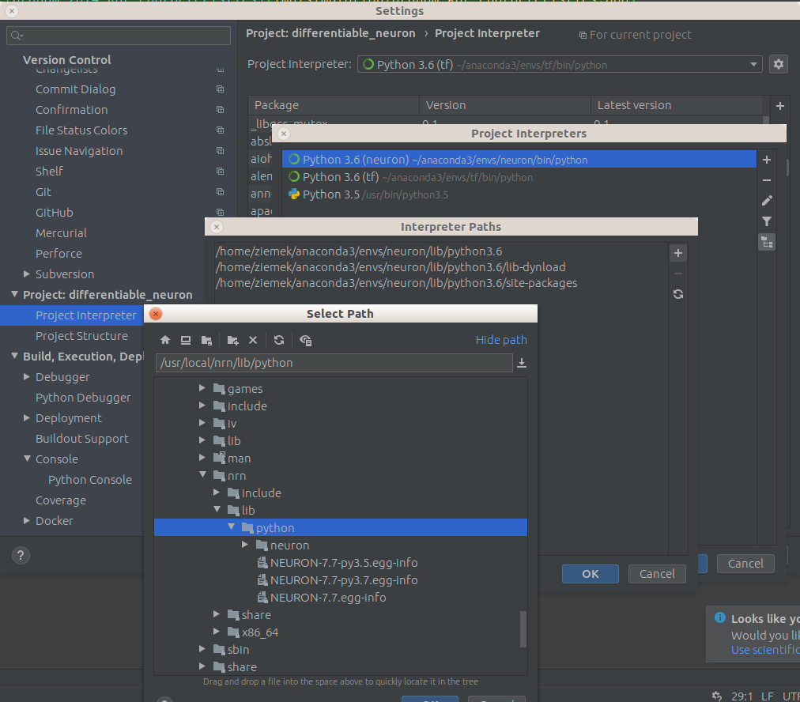

README contains instruction how to install NEURON and [Optional] NetPyNE
Repository contains files to test installation of those tools.

# Prerequisites
Works with Python 3.6. 

Other versions may have different issues, eg. 3.7 have problem with libpython3.7 and pycairo. It is possible to work with 3.7 but running from PyCharm may be error prone.

## Ubuntu
NEURON > 7.5 requires readline library:

* `sudo apt install libreadline5 python-lxml`

## CentOS

* `module load common/mpi/openmpi/3.1.4_gnu-7.3`
* `module load common/compilers/gcc/7.3.1`
* `rpm -q ncurses`
* `wget http://download-ib01.fedoraproject.org/pub/epel/7/x86_64/Packages/p/python36-Cython-0.28.5-1.el7.x86_64.rpm`


## Anaconda
Since some libs may have conflicting version with NetPyNE it's better to create a new env called neuron with Python 3.6

* `conda create --name neuron python=3.6`
* `conda activate neuron`

# NEURON Installation

## Ubuntu

* Download `*.deb` from https://www.neuron.yale.edu/neuron/download
* `dpkg -i neuron.deb`
* add to ~/.bashrc: 
`export PYTHONPATH="$PYTHONPATH:/usr/local/nrn/lib/python/"`

## CentOS

* Download `nrn*.tar.gz` from https://neuron.yale.edu/ftp/neuron/versions/
* extract to `nrn_source`
* Download `iv*.tar.gz` from https://neuron.yale.edu/ftp/neuron/versions/
* extract to `iv_source`
* `cd iv_source`
* `./configure --prefix=$HOME/iv`
* `make -j`
* `sudo make install -j`
* `cd ..`

* `cd nrn_source`
* `./configure --prefix=$HOME/nrn --with-iv=/where/is/iv --with-nrnpython=python --with-paranrn`
* `make`
* `make install`
* add to ~/.bashrc: 
`export PYTHONPATH="$PYTHONPATH:$HOME/nrn/lib/python/"`
`export PATH="$PATH:$HOME/nrn/x86_64/bin/"`

## Test NEURON:
  * run `neuron_example.py`

# [Optional] NetPyNE Installation
Install NetPyNE

* `pip install netpyne`
* `pip install pyneuroml`

## Test NetPyNE

* If you want to run it from IDE, preferably start IDE from the console to make sure PYTHONPATH is correctly loaded.
* run `netpyne_example.py`

## NetPyNE GUI

  ```python
  pip install netpyne_ui
  jupyter nbextension enable --py jupyter_geppetto
  jupyter serverextension enable --py jupyter_geppetto
  jupyter nbextension enable --py widgetsnbextension
  ```
### GUI Links:
* https://github.com/MetaCell/NetPyNE-UI
* GUI WIKI: https://github.com/MetaCell/NetPyNE-UI/wiki
* GUI Installation steps: https://github.com/MetaCell/NetPyNE-UI/wiki/Pip-installation

### Test GUI
* In console
  `NetPyNE-UI`

# Documentations

* NEURON: https://www.neuron.yale.edu/neuron/docs
* NetPyNE: http://netpyne.org/


# How to use NEURON with PyCharm



* Setting -> Project Interpreter -> click on interpreter list and select "Show All" -> Add or select your interpreter -> click "Show paths for the selected interpreter"
* add the path: /usr/local/nrn/lib/python

# Issues
* for problem with CentOS refer to: https://www.neuron.yale.edu/neuron/download/compile_linux

* libreadline5 issue:
  * during compiling *.mod file you have an error: `/usr/bin/ld: cannot find -lreadline`
  * during nrngui run from console you have an error: error while loading shared libraries: libreadline.so.5: cannot open shared object file: No such file or directory
  * during Python `from neuron import h` you have an error:
  ```bash
  Traceback (most recent call last):
    File "/usr/local/nrn/lib/python/neuron/__init__.py", line 110, in <module>
      import neuron.hoc
  ImportError: libreadline.so.5: cannot open shared object file: No such file or directory

  During handling of the above exception, another exception occurred:

  Traceback (most recent call last):
    File "<stdin>", line 1, in <module>
    File "/usr/local/nrn/lib/python/neuron/__init__.py", line 112, in <module>
      exec("import neuron.hoc%d%d as hoc" % (sys.version_info[0], sys.version_info[1]))
    File "<string>", line 1, in <module>
  ModuleNotFoundError: No module named 'neuron.hoc37'
  ```
  
  Install in bash console:
  ```bash
  sudo apt-get install libreadline5
  ```
